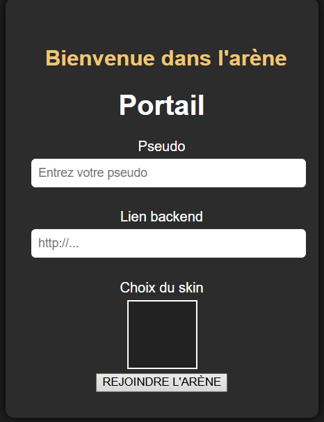
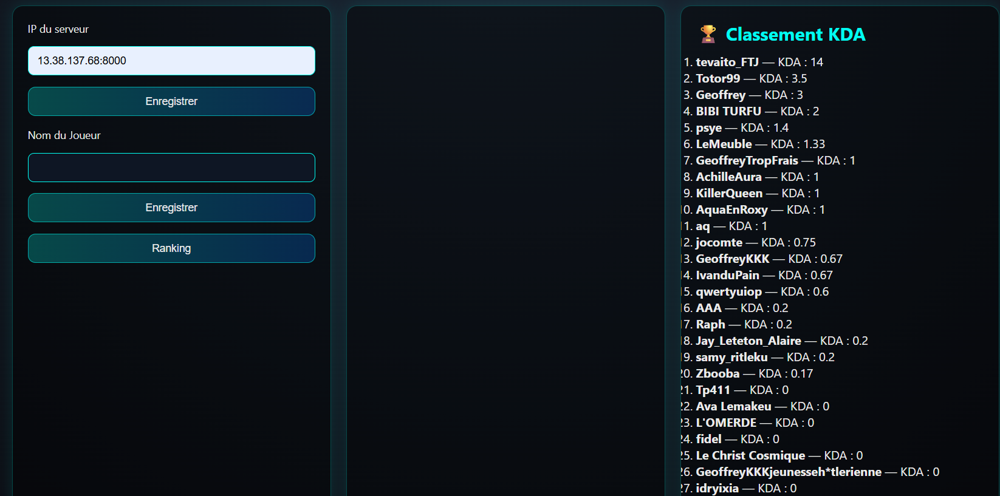

# Battle Royale System

## Overview

> This project implements a simple online Battle Royale system where players connect to a backend server. The server has been provided by our teacher.
In this little game, you can join friends in a shared lobby, and fight each other until only one remains. The backend manages authentication, matchmaking, real‑time communication, and combat events.

## Gameplay Screenshots

## Features

### Player Connection
- Secure login through the backend.
- Each player receives a unique session ID.
- Friends can join the same lobby before starting a match.
### Lobby & Match Start
- Players create or join a lobby.
- The host starts the match once everyone is ready.
- The server initializes the game world and spawns all players.
### Combat System
- Players can attack each other in real time.
- The server validates hits, damage, and eliminations.
- The last surviving player (or team) wins the match.
### Game Synchronization
- Real‑time updates for movement, health, and combat.
- Server is authoritative to prevent cheating.
- Match results are stored at the end.

### UI Elements

 - Portal

 
 
 - Skin Selection

 - Scoreboard

